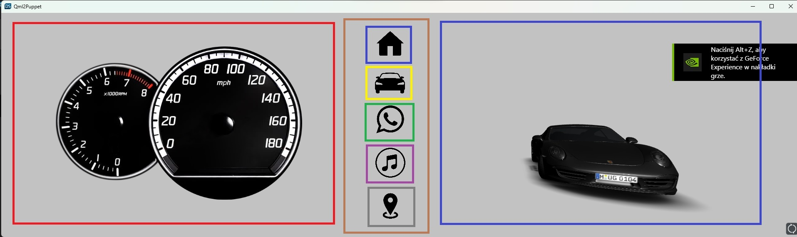

# Car Dashboard 

## Main goal
Create a modern Car Dashboar using QT framework(QT creator, QT desinger).

## How to start?
1. Download QT Framewrk.
2. Clone the repository.
3. Open QT Design.
4. Open project by clicking in project direcotry the "CarDashboard.qml" file.

## Example and division of Classes 



## Development
- C++20 (recommended g++ or clang++)
- CMake 3.21.1
- Qt 6.7.0
- Qt Design Studio 4.4
- Qt Creator 13.0
- clang-format
- clang-tidy
- cppcheck
- ninja
- valgrind

### Clone repository
- clone repository: `https://github.com/coders-school/car-dashboard`

### Qt
You can open project with:
- Qt Design Studio 
    - Run Qt Design Studio and open CarDashboard.qmlproject file.
    - User settings are saved in CarDashboard.qmlproject.qtds.
- Qt Creator
    - Run Qt Creator and open CMakeLists.txt file.
    - User settings are saved in CMakeLists.txt.user.

#### Generate CMake
If you added files in Qt Design Studio (.qml, .png, .svg, ...), you must generete CMake by run executable file.
Open Qt Design. Then File > Export > Generate CMake. In details select CMakes which you want generate and click ok.
`Warning: Please commit before generate`

### Run from terminal
#### 1. Run cmake
- For Unix
```
cmake -S <PROJECT DIR> -B <BUILD DIR> -DCMAKE_PREFIX_PATH=[QT DIR]/[QT VERSION]/gcc_64 ...
```
- For Windows
```
cmake -S <PROJECT DIR> -B <BUILD DIR> -DCMAKE_PREFIX_PATH=[QT DIR]/[QT VERSION]/mingw ...
```
Example:
```
cmake -S . -B build -DCMAKE_PREFIX_PATH=/home/user/Qt/6.7.0/gcc_64 -G Ninja
```
Or
```
mkdir build
cd build
cmake .. -DCMAKE_PREFIX_PATH=/home/user/Qt/6.7.0/gcc_64
```
#### 2. Build
```
cmake --build <PROJECT DIR>
```
For ninja:
```
ninja -C <BUILD DIR>
```
Examples:
```
cmake --build build
ninja -C build
```
#### 3. Run
```
./<BUILD DIR>/CarDashboardApp
```
#### 4. Unit tests
````
ctest --test-dir <BUILD DIR>
````
For ninja:
```
ninja -C <BUILD DIR> test
```
Or run executable file directly:
```
./build/utest/CarDashboardApp_UnitTest
./build/utestQml/CarDashboardApp_UnitTestQml
```

### Code analysis
#### CMake targets
CMake provided following targets for code analysis:
- `clang-format` - formating code
- `clang-format-check` - check formating without chagned code
- `cppcheck-check` - run cppcheck
- `clang-tidy-check` - run clang-tidy without chagned code
- `clang-tidy-fix` - run clang-tidy and fix code

Run cmake target:
```
cmake --build <BUILD DIR> --target <TARGET NAME>
```
For ninja
```
ninja -C build <TARGET NAME>
```

#### clang-format
CMake targets:
- clang-format
- clang-format-check

#### cppcheck
CMake targets:
- cppcheck-check

#### clang-tidy
CMake targets:
- clang-tidy-check
- clang-tidy-fix

#### valgrind
```
valgrind --leak-check=full \
         --show-leak-kinds=all \
         --track-origins=yes \  
         --verbose \
         ./<BUILD DIR>/CarDashboardApp
```

## Description

### $${\color{red}1.Class \space Car \space Gauges}$$

- Speed Gauge
- RPM Gauge
- Additional: timer, thermometer etc.
  
### $${\color{blue}2.Class \space 3D \space Car}$$

- 3D car model that can be moved by mouse
- Open doors and trunk by using buttons on screen 

### $${\color{yellow}3.Class \space A/C \space Sit \space Control}$$

- Change the temperature by using A/C button
- Change the postion of sit by using sit control button  

### $${\color{green}4.Class \space Phone \space Calling}$$

- Choose number to call
- Adding new phone numbers to phone book

### $${\color{purple}5.Class \space Music \space Player}$$

- Change music
- Change beetwen radio and songs 
- Mute, volume etc.

### $${\color{grey}6.Class \space Navigation}$$

- Navigation map
- Search tool bar


### $${\color{brown}7.Class \space Menu}$$

- Switching menu beetwen classes (apart from Gauges)
- Seperate Right from the Left side of the screen