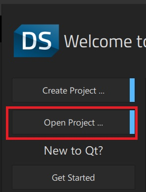
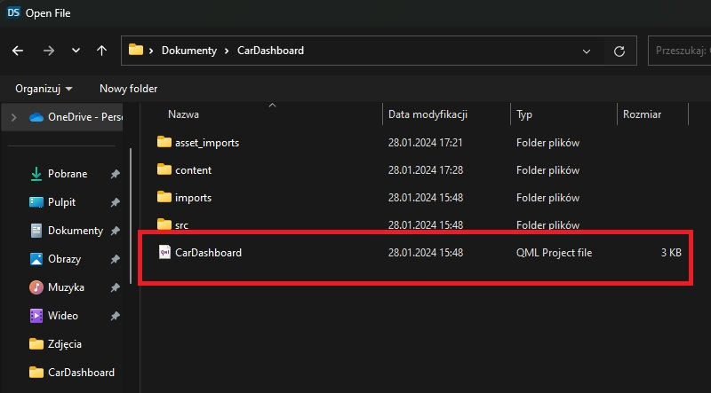
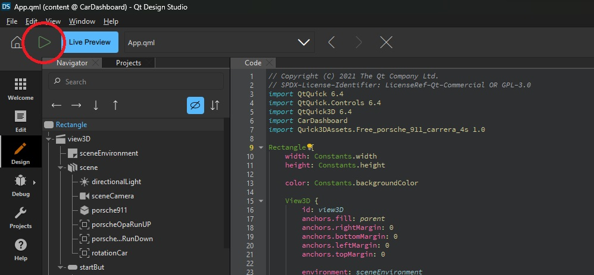

# car-dashboard

# How to start 
1. Download Qt (Creator and Design)
2. Clone the repository
3. Open Project in QT Design

   
  
  
  
5. Clcik on the Porsche logo

# Description 
Starting from scratch to modern car dashboard with all functionality by using QT framework. 
